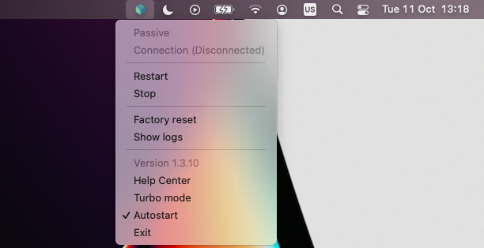
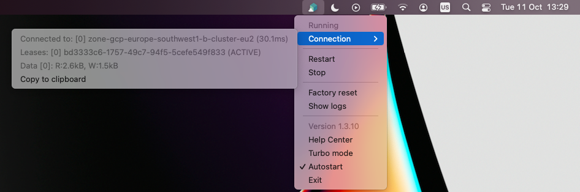
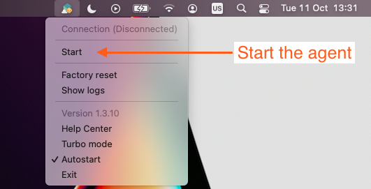
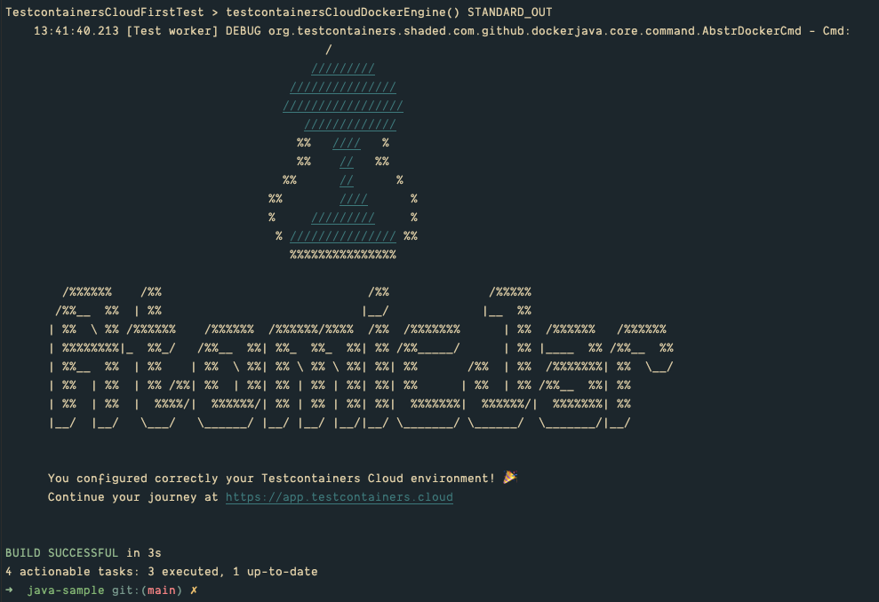

# testcontainers-cloud-java-example

The current repository helps you to verify that you configured your [Testcontainers Cloud][tcc] agent correctly in your local environment.
To bootstrap an actual project, please refer to the [Testcontainers Java Quickstart](https://github.com/testcontainers/testcontainers-java-spring-boot-quickstart).

## Clone the repository and run the first Testcontainer test suite

```
git clone https://github.com/AtomicJar/testcontainers-cloud-java-example
cd testcontainers-cloud-java-example
./mvnw test
```

## Verify the agent is running

✅ __Passive State__: Agent awaiting a Testcontainers test to be executed. 



✅ __Running State__: Agent connected to Testcontainers Cloud.



⚠️ __Stopped State__: Agent is stopped and will not accept connections.

Please, Start the agent to continue.



To download the agent for local usage, check the [download page here][tcc-download].

## Run the test suite

`./mvnw test`

### Your environment is correctly configured if

Test output:



Agent status:


[tcc]: https://testcontainers.cloud/
[tcc-download]: https://app.testcontainers.cloud/start/download?mode=update
